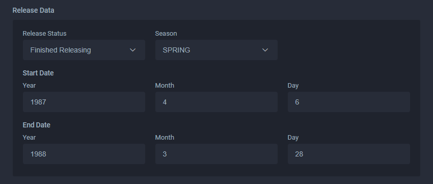

# Start and End Date

## Start Date

The date that the work began airing or began serialization.

If a title releases early but then continues that release in a regular schedule, the start date should reflect that earlier release and the airing episode count should reflect it as well.

If a title was pre-screened at an event, regardless of location, the _**normal**_ broadcast date is to be used.


For works such as one-shots, standalone movies, and anthologies, both the start and end date should be set to the same day. This gives it a '_Release Date_' label in the main entry.


## End Date

The date that the work is confirmed to have finished airing or finished serialization.

